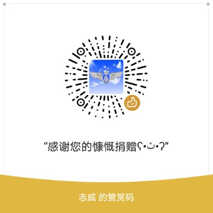

<p align="center">
  
</p>

<h1 align="center">启椟 · Kidux</h1>

<p align="center">
  <strong>面向互联网从业者的 macOS 一键开箱装机助手</strong><br/>
  选岗位 · 逛软件 · 一键安装 — 底层 Homebrew，本地优先，不含破解
</p>

<p align="center">
  <a href="https://github.com/iOrchid/Kidux/releases/latest"></a>
  
  
  <a href="LICENSE"></a>
  <a href="https://github.com/iOrchid/Kidux/stargazers"></a>
  <a href="https://github.com/iOrchid/Kidux/network/members"></a>
  <a href="https://github.com/iOrchid/Kidux/issues"></a>
  
  
  <a href="https://iorchid.github.io/Kidux/"></a>
</p>

<p align="center">
  <a href="https://github.com/iOrchid/Kidux/releases/latest"><strong>⬇ 下载 macOS 版</strong></a>
  ·
  <a href="https://iorchid.github.io/Kidux/">官网</a>
  ·
  <a href="CONTRIBUTING.md">参与贡献</a>
  ·
  <a href="https://github.com/iOrchid/Kidux/discussions">Discussions</a>
</p>


## 简介

换新 Mac、重装系统或入职配机时，不必一条条搜 brew 命令：

1. **选岗位** — 前端、后端、iOS、DevOps、产品等预设 Bundle  
2. **勾工具** — 合并清单，CLI / GUI 分类，已安装可跳过  
3. **一键安装** — Homebrew / Cask / 可选 Mac App Store（mas）  
4. **持续发现** — Catalog 浏览与搜索，按需补齐  

> 安装能力来自 Homebrew 生态。**不内置、不分发破解软件。**

| 用户可见名 | 工程目录 | 产物 |
|------------|----------|------|
| **启椟** | `Kidux/` | `启椟.app`（模块名仍为 Kidux） |


## 环境要求

- macOS 15+
- Xcode（与工程 Swift / deployment 一致）
- 可选：Homebrew（运行期安装能力依赖它）
- Apple Developer 账号（本机签名运行需要；免费 Apple ID 亦可用于 Development 签名）


## 配置、编译与运行

### 1. 克隆并打开工程

```bash
git clone https://github.com/iOrchid/Kidux.git
cd Kidux
open Kidux.xcodeproj
```

### 2. 配置 Apple Team ID

编辑 [`Kidux/Config/Signing.xcconfig`](Kidux/Config/Signing.xcconfig)：

```xcconfig
DEVELOPMENT_TEAM = YOUR_TEAM_ID
```

Team ID 可在 [Apple Developer Membership](https://developer.apple.com/account) 或 Xcode → Settings → Accounts → 选中 Team 后查看。

也可对照 [`Kidux/Config/Signing.xcconfig.example`](Kidux/Config/Signing.xcconfig.example)。

在 Xcode 中确认三个 Target（`Kidux` / `KiduxShareExtension` / `KiduxWidgets`）的 Signing 均选择同一 Team。

### 3. 配置仓库相关 URL（可选）

应用内更新检测、AI 模型列表、Sparkle appcast 等地址集中在：

[`Kidux/Config/RepositoryConfig.swift`](Kidux/Config/RepositoryConfig.swift)

Fork 后若使用自己的 GitHub 仓库，请修改其中的 `owner` / `name` / `defaultBranch`，并同步更新：

- `Kidux/Config/Signing.xcconfig` 中的 `INFOPLIST_KEY_SUFeedURL`
- 仓库内 `bin/appcast.xml`、`data/ai-model-catalog.json`（若仍通过 raw 对外提供）

### 4. 编译运行

**Xcode：** 选择 scheme `Kidux`，按 ⌘R 运行。

**命令行：**

```bash
xcodebuild -project Kidux.xcodeproj -scheme Kidux \
  -configuration Debug -derivedDataPath ./build/DerivedData build
```

预编译安装包见 [Releases](https://github.com/iOrchid/Kidux/releases)。给他人使用请下载公证后的 DMG。

## 卸载与反馈

1. 界面无响应时，可强制退出「启椟」（⌥⌘⎋）；活动监视器中如有残留 `brew` 进程可结束。  
2. 卸载应用：将「启椟」拖到废纸篓。  
3. 可选清理本应用数据（不会卸载已通过 Homebrew 安装的软件）：

```text
~/Library/Application Support/Kidux
```

4. Bug 与功能请求请使用 [Issues](https://github.com/iOrchid/Kidux/issues)；用法讨论见 [Discussions](https://github.com/iOrchid/Kidux/discussions)。


<a id="sponsor"></a>

## 来杯咖啡 ☕️ 

若本项目对你有帮助，欢迎 Star✨；也欢迎请作者喝杯咖啡，支持持续维护：

| 微信赞赏 | 支付宝 |
| :---: | :---: |
|  |  |

</p>

## License

[MIT](LICENSE)

```text
MIT License

Copyright (c) 2026 Kidux

Permission is hereby granted, free of charge, to any person obtaining a copy
of this software and associated documentation files (the "Software"), to deal
in the Software without restriction, including without limitation the rights
to use, copy, modify, merge, publish, distribute, sublicense, and/or sell
copies of the Software, and to permit persons to whom the Software is
furnished to do so, subject to the following conditions:

The above copyright notice and this permission notice shall be included in all
copies or substantial portions of the Software.

THE SOFTWARE IS PROVIDED "AS IS", WITHOUT WARRANTY OF ANY KIND, EXPRESS OR
IMPLIED, INCLUDING BUT NOT LIMITED TO THE WARRANTIES OF MERCHANTABILITY,
FITNESS FOR A PARTICULAR PURPOSE AND NONINFRINGEMENT. IN NO EVENT SHALL THE
AUTHORS OR COPYRIGHT HOLDERS BE LIABLE FOR ANY CLAIM, DAMAGES OR OTHER
LIABILITY, WHETHER IN AN ACTION OF CONTRACT, TORT OR OTHERWISE, ARISING FROM,
OUT OF OR IN CONNECTION WITH THE SOFTWARE OR THE USE OR OTHER DEALINGS IN THE
SOFTWARE.
```
